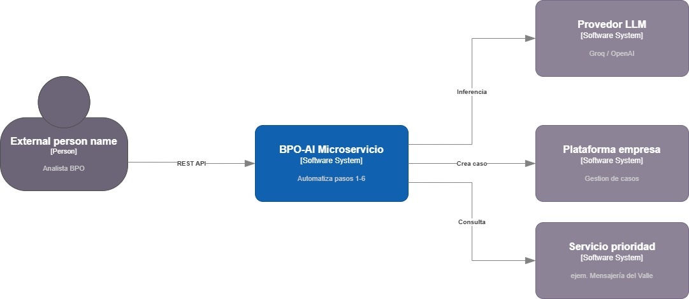
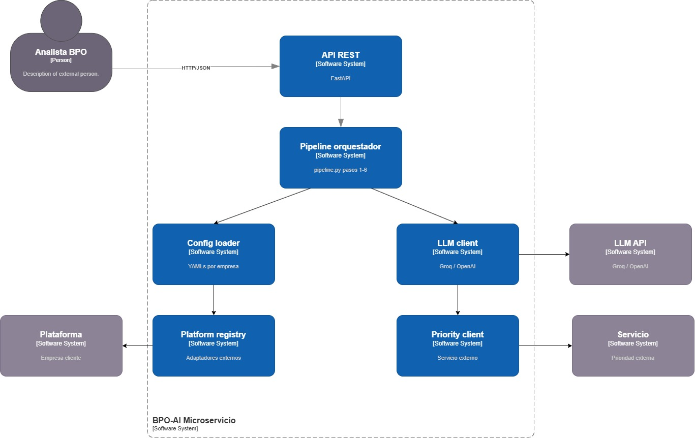
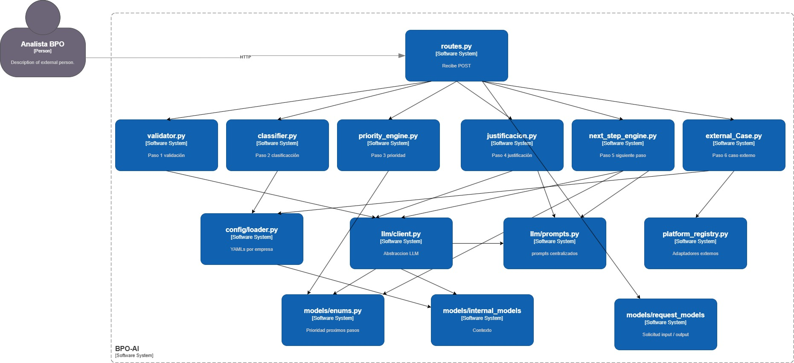

# Arquitectura del Sistema (Modelo C4)

Para garantizar que el microservicio sea **escalable, desacoplado y fácil de mantener** ante el crecimiento de nuevas compañías y categorías, la solución fue diseñada siguiendo el estándar de modelado C4, que permite describir la arquitectura en cuatro niveles de detalle progresivo.

---

## 1. Diagrama de Contexto (System Context)

Este diagrama define los límites del **Servicio Transversal de IA** y sus interacciones con los actores externos:

- **Analista BPO:** Consume el servicio vía API REST enviando solicitudes en texto libre. El sistema retorna la clasificación, prioridad, justificación y siguiente paso de forma automática, reduciendo la intervención manual.
- **Proveedor LLM (Groq / OpenAI / Anthropic):** El microservicio delega en un modelo de lenguaje las tareas que requieren comprensión semántica: validación del texto, clasificación de la solicitud y generación de justificaciones. El proveedor es intercambiable mediante variable de entorno.
- **Plataforma externa de la empresa:** Cuando una solicitud requiere gestión especializada, el sistema crea automáticamente el caso en la plataforma de atención del cliente corporativo. Cada empresa puede tener una plataforma distinta; el diseño las abstrae mediante adaptadores.
- **Servicio de prioridad externo:** Algunas empresas (como Mensajería del Valle) proveen su propio microservicio para determinar la prioridad de un caso. El sistema lo consulta cuando está configurado y aplica reglas locales como fallback si el servicio falla.

---

## 2. Diagrama de Contenedores (Container Diagram)

Este diagrama desglosa los contenedores que componen el microservicio y cómo se relacionan entre sí:

- **API REST (FastAPI):** Punto de entrada único del sistema. Recibe las solicitudes vía `POST /solicitudes/`, valida el esquema del request con Pydantic, y delega el procesamiento al pipeline. Expone también un endpoint de health check que lista las empresas configuradas.
- **Pipeline orquestador:** Coordina la ejecución secuencial de los 6 pasos del proceso. Implementa un cortocircuito en el paso 1: si la solicitud no tiene información mínima, retorna inmediatamente sin consumir más llamadas al LLM.
- **LLM Client:** Abstracción sobre los proveedores de modelos de lenguaje. Soporta Groq, OpenAI y Anthropic desde una interfaz única. El proveedor activo se configura mediante variables de entorno, sin modificar código.
- **Config Loader:** Lee y cachea los archivos YAML de configuración de cada empresa. Centraliza las categorías, reglas de prioridad y delegaciones. Agregar una nueva empresa requiere únicamente crear un nuevo archivo YAML.
- **Platform Registry:** Registro de adaptadores para las plataformas externas de cada cliente. Implementa el patrón adaptador: agregar soporte para una nueva plataforma implica crear una clase que implemente la interfaz base y registrarla, sin modificar el resto del sistema.
- **Priority Client:** Componente encargado de consultar el microservicio de prioridad externo cuando la empresa lo tiene configurado. Incluye manejo de errores con fallback automático a reglas locales si el servicio no responde.

---

## 3. Diagrama de Componentes (Component Diagram)

Este diagrama expone los componentes internos del pipeline orquestador y sus dependencias. Cada componente tiene una responsabilidad única y puede evolucionar de forma independiente:

- **validator.py (Paso 1):** Usa el LLM para verificar que la solicitud contenga información mínima (qué ocurrió, quién lo reporta). Adicionalmente extrae entidades clave: nombre del cliente, tipo y número de documento. Si la validación falla, el pipeline se cierra de inmediato con estado `CIERRE_POR_INFORMACION_INSUFICIENTE`.
- **classifier.py (Paso 2):** Clasifica el texto libre en una de las categorías definidas en el YAML de la empresa. Las categorías válidas se inyectan en el prompt, por lo que el LLM nunca puede inventar una categoría que no esté parametrizada. Incluye validación post-LLM y fallback.
- **priority_engine.py (Paso 3):** Motor de prioridad con dos estrategias desacopladas. Si la empresa tiene un servicio externo configurado (ej. Mensajería del Valle), lo consulta vía HTTP. Si no, aplica las reglas del YAML evaluando palabras clave y prioridades por defecto. El fallback es automático si el servicio externo falla.
- **justification.py (Paso 4):** Genera la justificación en lenguaje natural usando el LLM. A diferencia de los pasos anteriores, aquí el modelo solo redacta — la categoría y prioridad ya están decididas por los pasos previos y se pasan como hechos consumados al prompt.
- **next_step_engine.py (Paso 5):** Lógica puramente determinística. Consulta las delegaciones del YAML y decide entre `GESTION_EXTERNA` o `RESPUESTA_DIRECTA`. Si la categoría no está mapeada en ninguna delegación, escala a gestión externa por seguridad.
- **external_case.py (Paso 6):** Solo se ejecuta si el siguiente paso es `GESTION_EXTERNA`. Obtiene el adaptador de plataforma correspondiente a la empresa desde el registry y crea el caso. Si la plataforma falla, el estado queda como `PENDIENTE_REINTENTO` y se registra el error para monitoreo.
- **llm/client.py y llm/prompts.py:** Infraestructura compartida por los pasos 1, 2 y 4. El cliente abstrae el proveedor LLM; los prompts están centralizados en un único archivo para facilitar su ajuste sin tocar la lógica de negocio.
- **config/loader.py:** Compartido por todos los pasos que necesitan reglas de la empresa. Usa `lru_cache` para evitar lecturas repetidas a disco.
- **models/:** Capa de datos compartida. `ContextoPipeline` es el objeto que viaja por todo el pipeline acumulando los resultados de cada paso. `enums.py` centraliza los valores permitidos para prioridad, estado y siguiente paso.